# 研究紹介

<a href="researches/r_anada_v250702.pdf">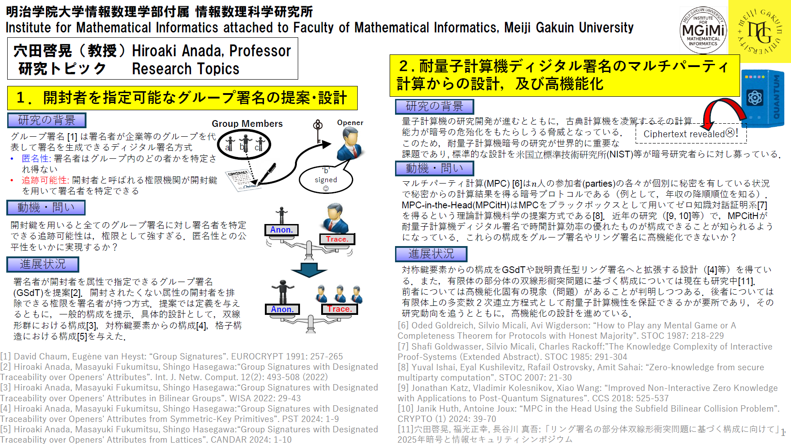</a>
<a href="researches/r_abe_v250702.pdf">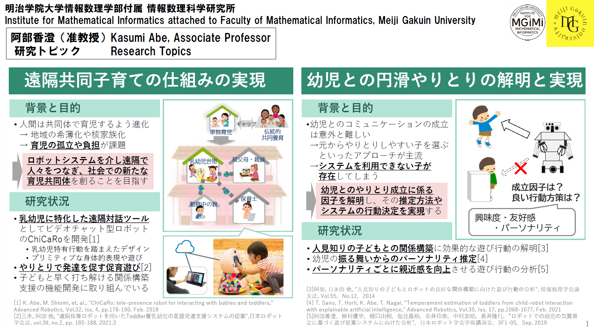</a>
<a href="researches/r_ohta_v250702.pdf">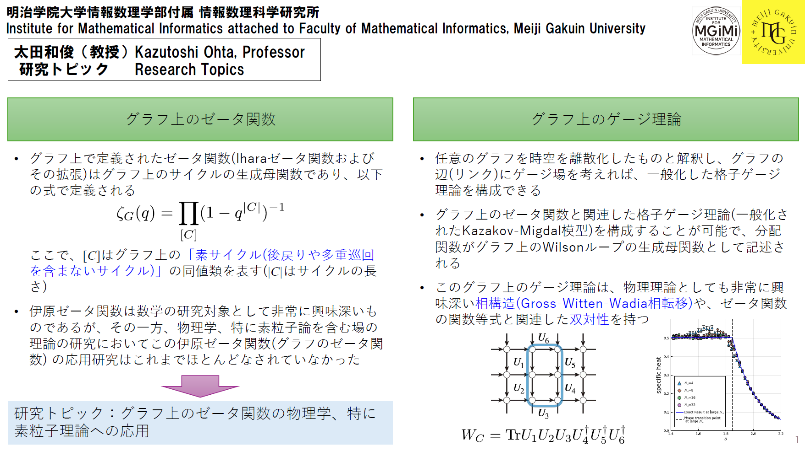</a>
<a href="researches/r_ogushi_v250702.pdf">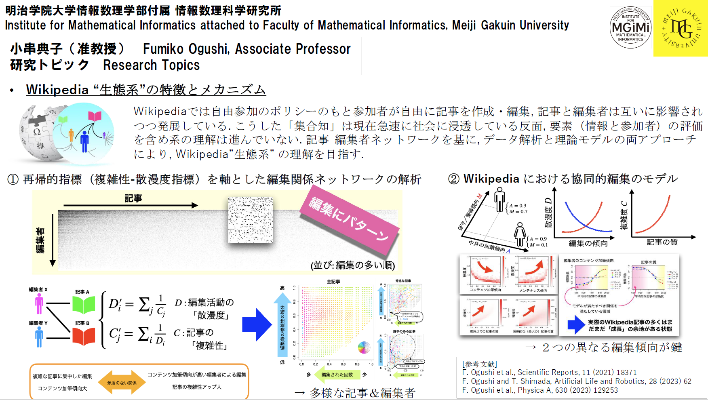</a>
<a href="researches/r_kasuya_v250702.pdf">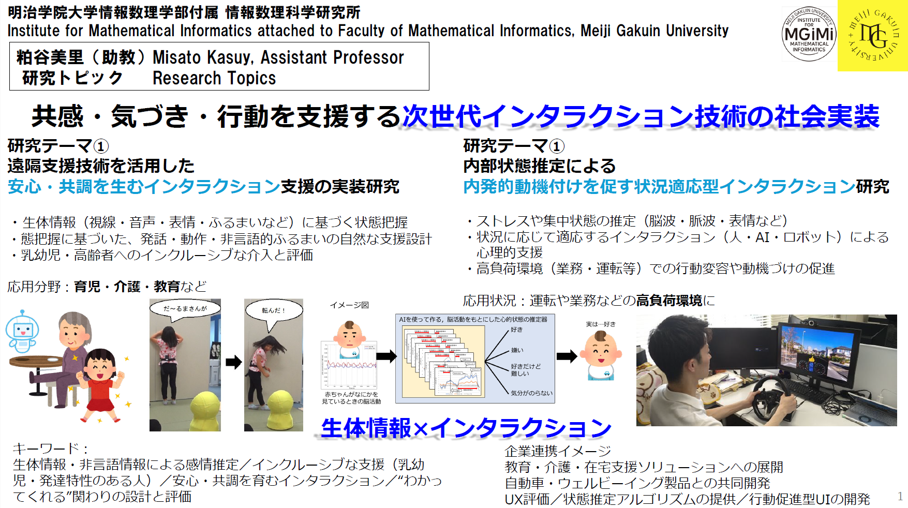</a>
<a href="researches/r_kadoh_v250702.pdf">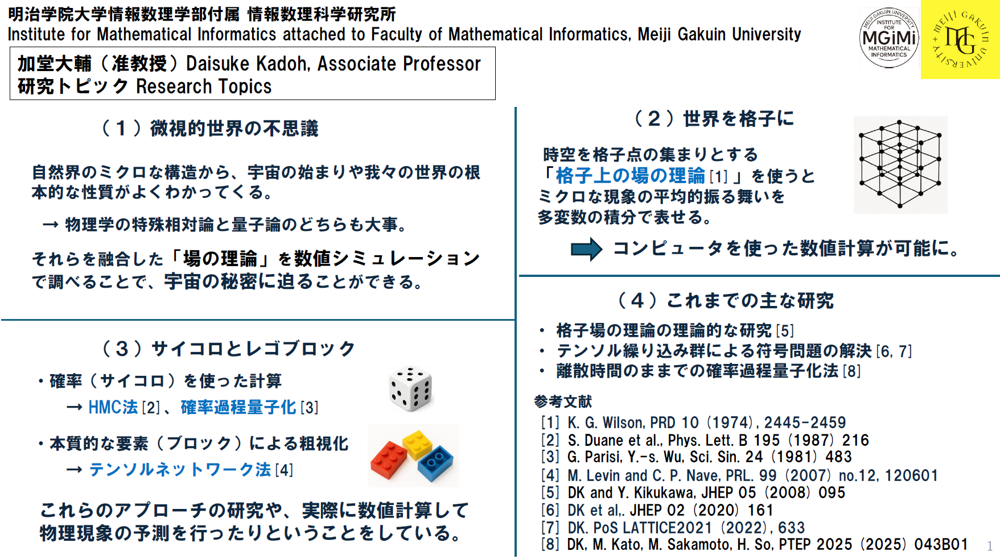</a>
<a href="researches/r_kameda_v250702.pdf">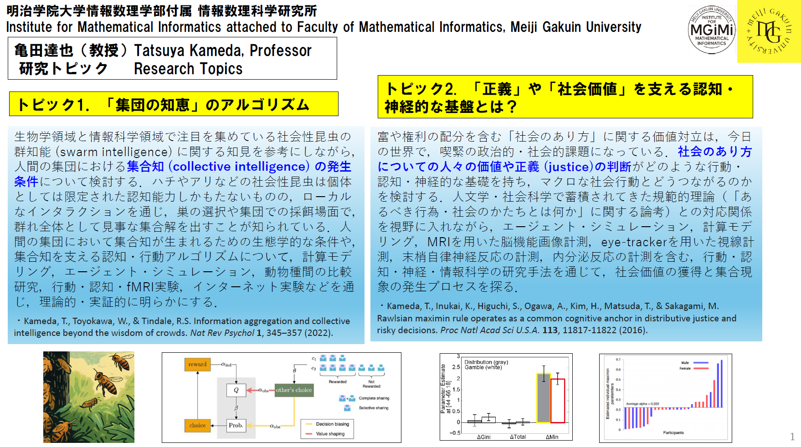</a>
<a href="researches/r_kawashima_v250702.pdf">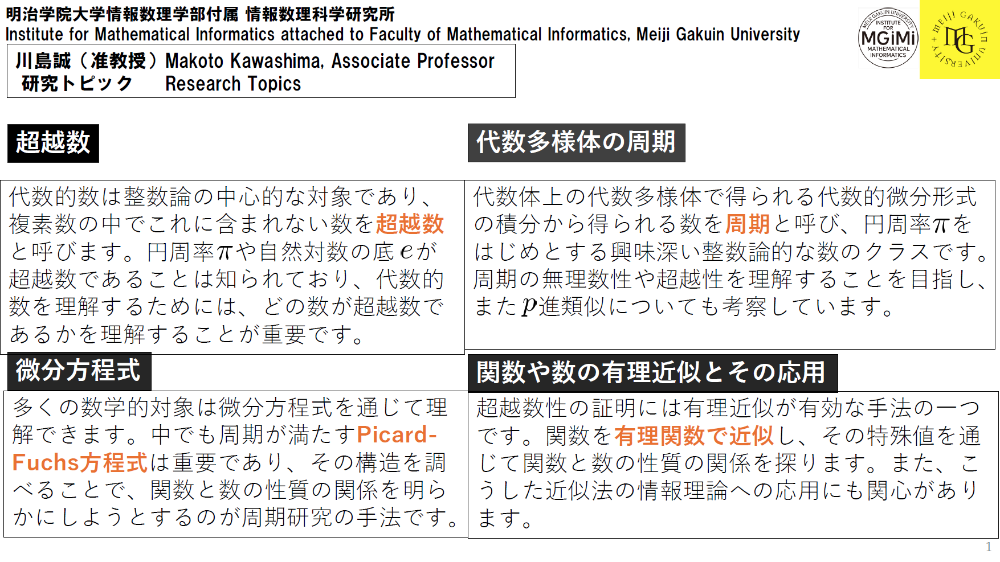</a>
<a href="researches/r_sakai_v250702.pdf">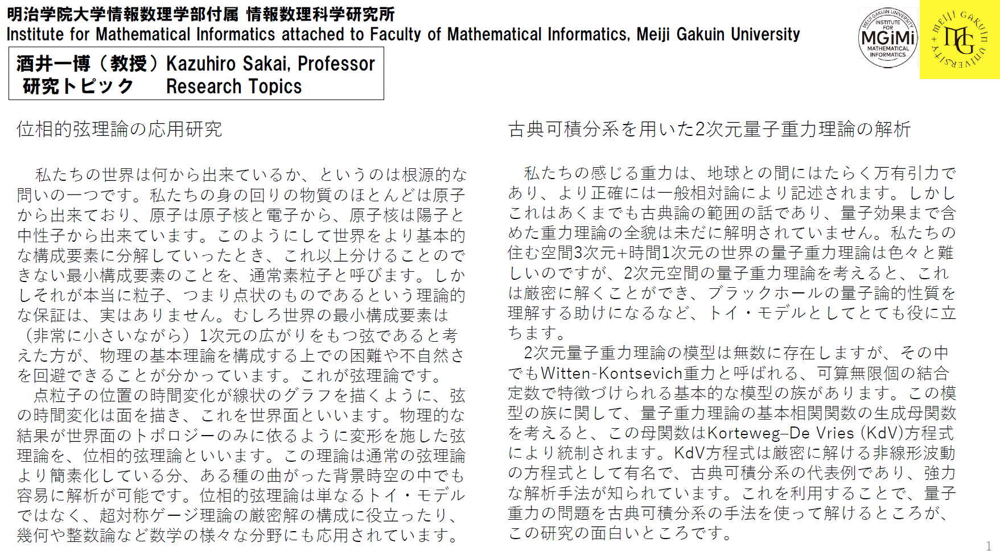</a>
<a href="researches/r_sasaki_v250702.pdf">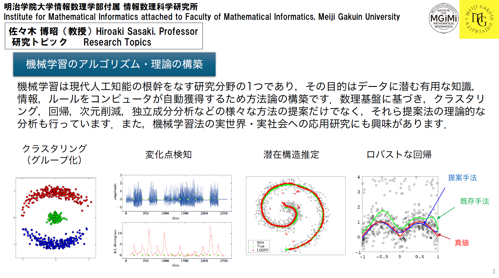</a>
<a href="researches/r_nagata_v250702.pdf">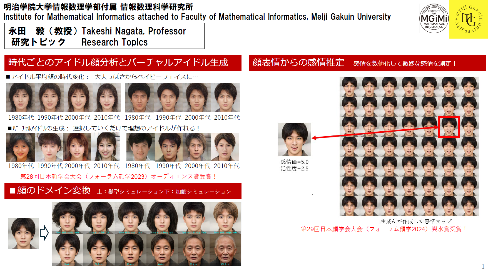</a>
<a href="researches/r_miyadera_v250702.pdf">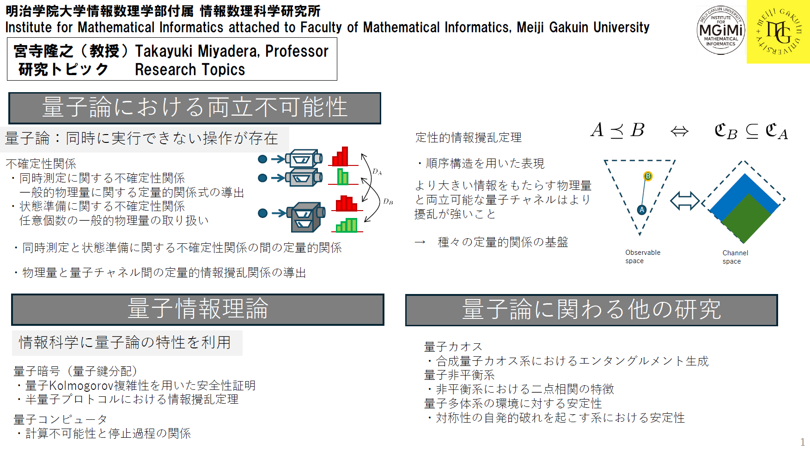</a>
<a href="researches/r_yamada_v250702.pdf">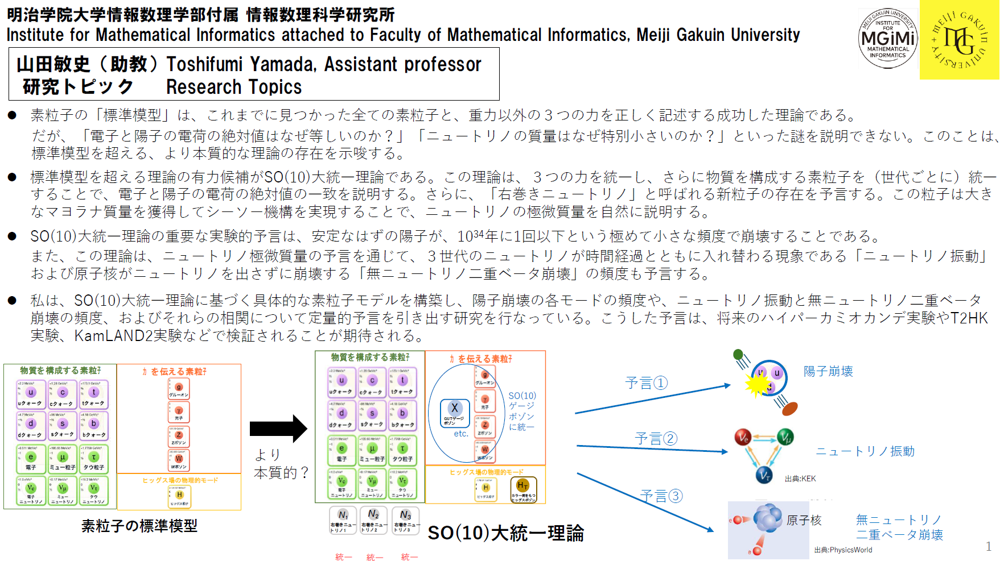</a>
<a href="researches/r_wada_v250702.pdf">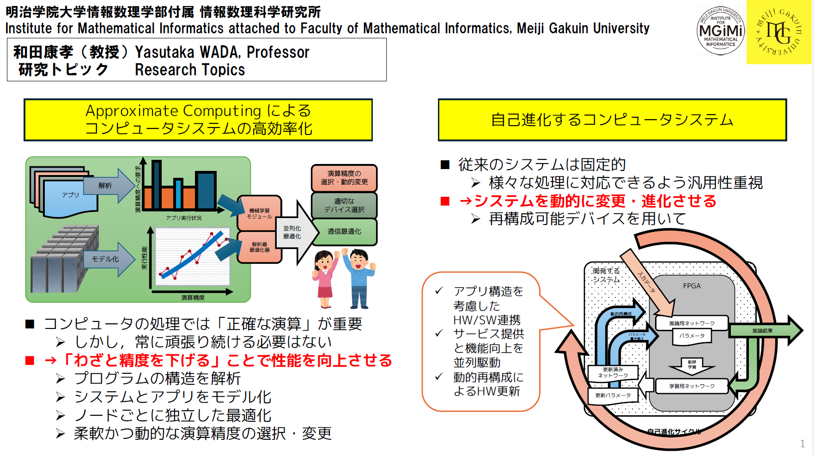</a>

<!--
## 数式が使えるかのテスト
これはインラインでの数式$E=mc^2$です。
ディスプレイスタイルも試してみます。
$$\int dx f(x)$$
-->

# 研究所年報
